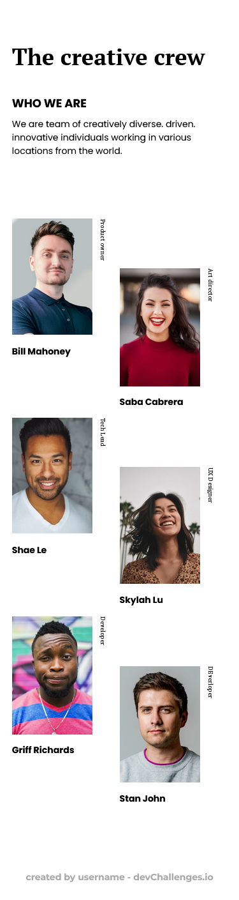

<!-- Please update value in the {}  -->

<h1 align="center">My Team Page Solution</h1>

   Solution for a challenge from  <a href="http://devchallenges.io" target="_blank">Devchallenges.io</a>.

  <h3>
    <a href="https://fernandolribeiro.github.io/my-team-page-solution/">
      Demo
    </a>
     | 
    <a href="https://{your-url-to-the-solution}">
      Solution
    </a>
     | 
    <a href="https://devchallenges.io/challenges/hhmesazsqgKXrTkYkt0U">
      Challenge
    </a>
  </h3>

## Table of Contents

- [Overview](#overview)
  - [Built With](#built-with)
- [Features](#features)
- [Contact](#contact)
- [Acknowledgements](#acknowledgements)

## Overview

This challenge was a bit harder than I expected, because to build it it's necessary to be familiar with CSS Grid, which honestly I wasn't before building this. With that said, this was some much needed practice and pushed to actually learn how to use CSS Grid, since it became easier to just learn Grid over trying to build this design using Flexbox.

### Built With

- HTML
- CSS

## Features

This application/site was created as a submission to a [DevChallenges](https://devchallenges.io/challenges) challenge. The [challenge](https://devchallenges.io/challenges/hhmesazsqgKXrTkYkt0U) was to build an application to complete the given user stories.

## Acknowledgements

- [Steps to replicate a design with only HTML and CSS](https://devchallenges-blogs.web.app/how-to-replicate-design/)
- [CSS Grid Tutorial](https://www.youtube.com/playlist?list=PL4cUxeGkcC9itC4TxYMzFCfveyutyPOCY)

## Contact

- GitHub [@fernandLRibeiro](https://github.com/fernandoLRibeiro/)
